# Docsmith

[](https://opensource.org/licenses/MIT)
[](https://github.com/NguyenAnhDuc/docsmith)
[](https://github.com/NguyenAnhDuc/docsmith)

**PRC-010**: AI-guided documentation workflow for creating structured, high-quality docs.

Based on industry best practices from *Docs for Developers* (Bhatti et al., 2021) and *Strategic Writing for UX* (Podmajersky, 2019).

---

## ✨ Features

- 🎯 **Systematic 11-step workflow** from audience analysis to publication
- 🤖 **AI-powered drafting** with built-in quality checks
- 📊 **UX content standards** (voice chart, text patterns, scorecard)
- ✅ **Automated verification** via product walkthrough with screenshots
- 🔄 **Human-in-the-loop** review gates at critical stages
- 📦 **Professional templates** for all documentation types

---

## 🚀 Quick Start

### Installation

**Claude Code** (recommended):
```bash
/plugin marketplace add https://github.com/NguyenAnhDuc/docsmith.git
/plugin install docsmith@nguyenanhduc-docsmith
/reload-plugins
```

**Cursor / Copilot**:
```bash
# Project-scope (recommended for teams)
git clone https://github.com/NguyenAnhDuc/docsmith.git .cursor/agents/docsmith

# Or global
git clone https://github.com/NguyenAnhDuc/docsmith.git ~/.cursor/agents/docsmith
```

### Usage

**Claude Code**:
```bash
/docsmith help                    # Show all commands
/docsmith start MyProduct         # Begin full workflow
/docsmith draft APIEndpoint       # Quick draft only
/docsmith verify MyProduct        # Run quality checks
```

**Cursor / Copilot** (conversational):
```
"Use docsmith to create documentation for my Payment API"
"Help me plan documentation following PRC-010"
"Draft a getting started guide for UserManagement"
```

---

## 📋 Workflow

```mermaid
graph LR
    A[Audience] --> B[Plan]
    B --> C[Review Plan]
    C --> D[Sitemap]
    D --> E[Voice Standards]
    E --> F[Draft]
    F --> G[Edit]
    G --> H[Walkthrough]
    H --> I[Peer Review]
    I --> J[Incorporate]
    J --> K[Publish]
    
    style A fill:#e1f5ff
    style B fill:#fff9e1
    style C fill:#ffe1e1
    style D fill:#fff9e1
    style E fill:#fff9e1
    style F fill:#fff9e1
    style G fill:#fff9e1
    style H fill:#fff9e1
    style I fill:#ffe1e1
    style J fill:#fff9e1
    style K fill:#e1ffe1
```



| Step | Owner | Description |
|------|-------|-------------|
| **1. audience** | 👤 Human | Define target users, goals, personas |
| **2. plan** | 🤖 AI | Documentation plan + traceability matrix |
| **3. review-plan** | 👤 Human | Approve plan |
| **4. sitemap** | 🤖 AI | Folder structure, navigation, cross-links |
| **5. voice** | 🤖 AI | Voice chart, UX patterns, scorecard |
| **6. draft** | 🤖 AI | Write documentation |
| **7. edit** | 🤖 AI | Self-review (5 passes) |
| **8. walkthrough** | 🤖 AI | Test on product + screenshots |
| **9. peer-review** | 👤 Human | Review docs |
| **10. tech-review** | 👤 Human | Optional technical review |
| **11. incorporate** | 🤖 AI | Integrate feedback |
| **12. publish** | 👤 Human | Final approval & release |

---

## 📖 Commands Reference

| Command | Alias | Description | Example |
|---------|-------|-------------|---------|
| `help` | `h` | Show command reference | `/docsmith help` |
| `start` | — | Begin full process | `/docsmith start MyProduct` |
| `audience` | `aud` | Define audience & goals | `/docsmith aud PaymentAPI` |
| `plan` | `pl` | AI creates doc plan | `/docsmith plan PaymentAPI` |
| `review-plan` | `rp` | Human review gate | `/docsmith rp PaymentAPI` |
| `sitemap` | `sm` | AI creates structure | `/docsmith sm PaymentAPI` |
| `voice` | `vc` | UX content standards | `/docsmith vc PaymentAPI` |
| `draft` | `dr` | AI writes docs | `/docsmith draft PaymentAPI` |
| `edit` | `ed` | AI self-review (5 passes) | `/docsmith ed PaymentAPI` |
| `walkthrough` | `wt` | Test on real product | `/docsmith wt PaymentAPI` |
| `validate` | `val` | Re-run tests only | `/docsmith val PaymentAPI` |
| `test` | `t` | Create test cases | `/docsmith test PaymentAPI` |
| `verify` | `vf` | Run all checks | `/docsmith verify PaymentAPI` |
| `peer-review` | `pr` | Human peer review | `/docsmith pr PaymentAPI` |
| `tech-review` | `tr` | Technical review | `/docsmith tr PaymentAPI` |
| `incorporate` | `inc` | Integrate feedback | `/docsmith inc PaymentAPI` |
| `publish` | `pub` | Final approval | `/docsmith pub PaymentAPI` |

---

## 💡 Examples

### Document new API
```bash
/docsmith start PaymentAPI
# Follow prompts: audience → plan → draft → walkthrough → publish
```

### Update existing docs
```bash
/docsmith draft UserManagement
/docsmith verify UserManagement
```

### Quality check specific files
```bash
/docsmith verify MyProduct docs/drafts/getting-started.md
/docsmith verify MyProduct docs/drafts/api-*.md
```

---

## 📂 Output Structure

```
docs/
├── plan/
│   ├── audience-profile.md
│   ├── documentation-plan.md
│   └── traceability-matrix.md
├── standards/
│   ├── voice-chart.md
│   ├── ux-text-patterns.md
│   └── ux-content-scorecard.md
├── drafts/
│   ├── getting-started.md
│   ├── tutorials/
│   ├── reference/
│   └── api/
├── walkthrough/
│   ├── test-cases.md
│   └── test-execution.md
└── images/
    └── walkthrough/
```

---

## 🎨 Templates Included

- ✅ Audience Profile
- ✅ Documentation Plan
- ✅ Traceability Matrix
- ✅ Voice Chart
- ✅ UX Text Patterns
- ✅ UX Content Scorecard
- ✅ Walkthrough Test Cases
- ✅ Content Type Templates:
  - Getting Started
  - Tutorials
  - How-To Guides
  - Reference
  - API Documentation
  - Troubleshooting

---

## 🛠️ Cross-Platform Support

| Platform | Installation | Trigger | Auto-invoke |
|----------|--------------|---------|-------------|
| **Claude Code** | Plugin marketplace | `/docsmith` | ❌ Disabled |
| **Cursor** | Git clone to `.cursor/agents/` | Natural language | ✅ Auto-detect |
| **GitHub Copilot** | Git clone to `.github/copilot/agents/` | `@docsmith` | ✅ Auto-detect |
| **OpenAI Codex** | Git clone to `~/.codex/agents/` | `--agent docsmith` | ❌ Explicit |

---

## 🏗️ Team Deployment

**For BSS/Engineering teams:**

1. **Add to project repo**:
   ```bash
   cd /path/to/your-project
   mkdir -p .cursor/agents
   git clone https://github.com/NguyenAnhDuc/docsmith.git .cursor/agents/docsmith
   git add .cursor/
   git commit -m "Add DocSmith documentation agent"
   ```

2. **Team members pull**:
   ```bash
   git pull
   # Cursor auto-detects agent
   ```

3. **Usage**:
   ```
   "Use docsmith to document the new OAuth2 flow"
   ```

---

## 📚 Documentation

- **Process Reference**: [SKILL.md](plugins/docsmith/skills/docsmith/SKILL.md)
- **Tools Reference**: [tools-reference.md](plugins/docsmith/tools-reference.md)
- **Publishing Guide**: [PUBLISHING.md](plugins/docsmith/PUBLISHING.md)
- **Changelog**: [CHANGELOG.md](plugins/docsmith/CHANGELOG.md)

---

## 🤝 Contributing

Contributions welcome! Please:
1. Fork the repo
2. Create feature branch (`git checkout -b feature/amazing-feature`)
3. Commit changes (`git commit -m 'Add amazing feature'`)
4. Push to branch (`git push origin feature/amazing-feature`)
5. Open Pull Request

---

## 📄 License

MIT License - see [LICENSE](LICENSE) for details.

---

## 👤 Author

**Duc Nguyen**  
- GitHub: [@NguyenAnhDuc](https://github.com/NguyenAnhDuc)
- Email: nguyenanhduc01120@gmail.com

Based on FPT Smart Cloud PRC-010 documentation standard.

---

## 🐛 Support

- **Issues**: [GitHub Issues](https://github.com/NguyenAnhDuc/docsmith/issues)
- **Discussions**: [GitHub Discussions](https://github.com/NguyenAnhDuc/docsmith/discussions)

---

## ⭐ Star History

If you find DocSmith useful, please consider starring the repo!

[](https://star-history.com/#NguyenAnhDuc/docsmith&Date)

---

**Built with ❤️ for better documentation**
